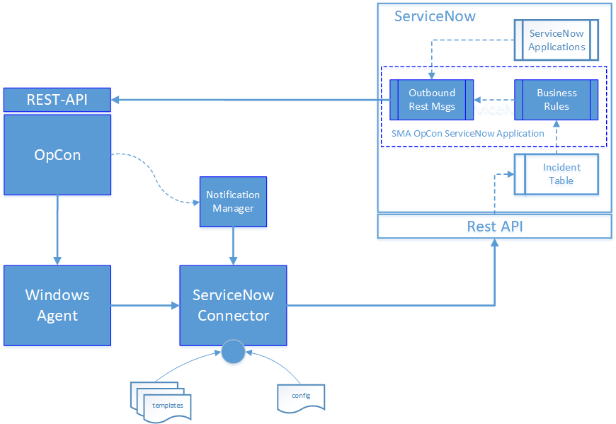
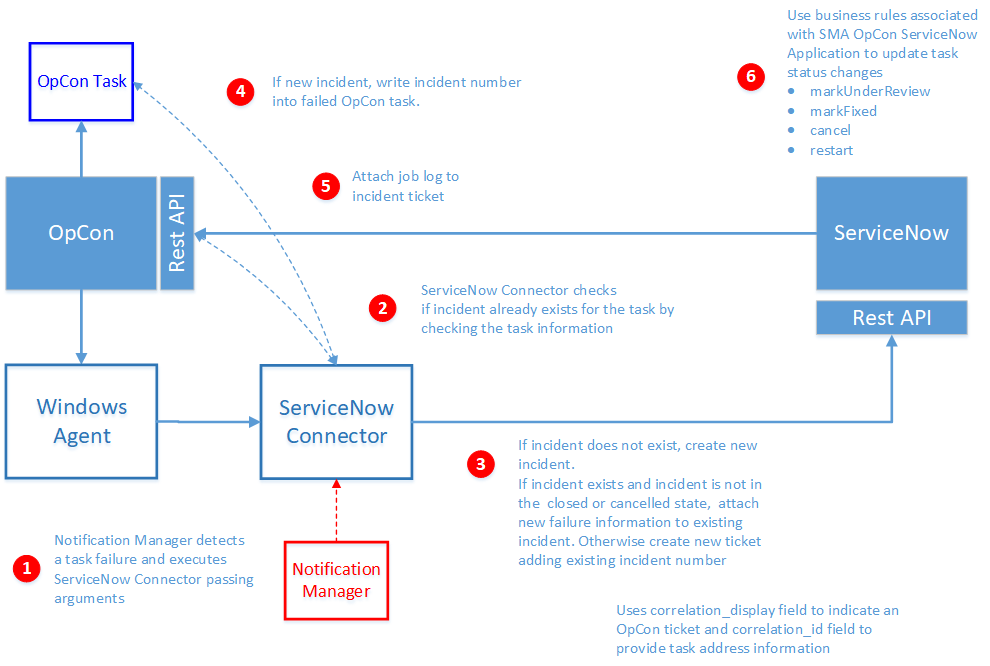

# ServiceNow Connector

## What is it?

The ServiceNow Connector submits incident tickets automatically to ServiceNow from OpCon when a task ends with an error. The connector and the SMA OpCon ServiceNow Application keep the OpCon task status synchronized with the corresponding ServiceNow incident state.

- Use this when your organization tracks failed OpCon tasks as ServiceNow incidents and wants the OpCon task status to reflect the incident lifecycle automatically.
- Use this to avoid manual ticket creation and manual task status updates after a failed task is investigated and resolved in ServiceNow.

### How OpCon and ServiceNow stay in sync

When the ServiceNow incident state changes, the OpCon task state can be updated automatically:

| ServiceNow incident state | OpCon task state | What it means |
| --- | --- | --- |
| **In Progress** (accepted) | **Under Review** | Someone is working on the error. |
| **Resolved** | **Fixed** or **Restart** | The error has been corrected. |
| **Cancelled** | (task cancelled) | The OpCon task can be cancelled automatically. |

## Components

The OpCon ServiceNow implementation includes components that:

- detect when a task errors,
- create the ServiceNow incident record (and attach the task's job log), and
- automatically update the OpCon task status when the incident state changes.

### Notification Manager

An OpCon feature that initiates the ServiceNow Connector when a task encounters an error condition.

### Windows Agent

An OpCon Windows Agent that is used to run the ServiceNow Connector.

### ServiceNow Connector

An OpCon connector that communicates with ServiceNow through the ServiceNow Rest-API to create an incident.

### Templates

JSON files that contain the ServiceNow definitions used for a connection. One template can be created per ServiceNow instance.

### Config

Defines the connection to the OpCon System, the proxy server (if required), and the directories used by the ServiceNow Connector.

### Business Rules

Part of an SMA OpCon ServiceNow Application that contains business rules triggered when the status of the incident ticket is updated:

- OpConTicketAccepted
- OpConTicketResolved
- OpConTicketRelease
- OpConTicketCanceled

The business rules submit outbound Rest messages back to OpCon. See [Business rules in detail](#business-rules-in-detail) below.

### Outbound Rest Messages

Part of an SMA OpCon ServiceNow Application that contains outbound Rest messages used to communicate with OpCon through the OpCon Rest-API. They update the task status, and provide additional messages that other ServiceNow applications can use to instruct OpCon:

- updateJobStatusById
- buildSchedule
- getDailyScheduleByNameAndDate
- addJobToScheduleInDaily
- getApiVersion

## Ticket creation process

When a task fails, the connector follows six steps to create or update the corresponding ServiceNow incident.

At a glance:

1. Notification Manager runs the connector and passes the failed task's details.
2. The connector checks whether an incident already exists for the task.
3. If an incident exists, it is updated and reopened — unless it is closed or cancelled, in which case a new incident is created.
4. The incident number and `sys_id` are written back to the OpCon task.
5. Optionally, the task's job log is attached to the incident.
6. After the incident is updated in ServiceNow, business rules call back to OpCon to keep the task state in sync.

The sections below expand on each step.

### Step 1. Notification Manager runs the connector

Notification Manager runs the ServiceNow Connector when it detects a failed task, and passes the failed task's details using standard OpCon properties:

| Property | Description |
| -------- | ----------- |
| `$MACHINE NAME` | The name of the agent on which the task was running. |
| `$JOB TERMINATION` | The termination code of the task. |
| `$SCHEDULE DATE-SNOW` | A special version of the schedule date format created to support the ServiceNow Connector. |
| `$SCHEDULE ID` | The schedule ID of the workflow in the OpCon System. |
| `$SCHEDULE INST` | The schedule instance of the workflow in the Daily OpCon table. |
| `$SCHEDULE NAME` | The name of the workflow. |
| `$JOB NAME` | The name of the task. |

### Step 2. Check for an existing incident

Before creating a new incident ticket, the connector checks whether one has already been created for the task. The task information is extracted from the OpCon Daily Job table.

### Step 3. Update an existing incident or create a new one

If an incident ticket exists, the connector retrieves it from ServiceNow and checks its state.

- If the incident is **closed** or **cancelled**, a new incident is created. The previous ticket number is added to the task documentation and to the new incident's description.
- Otherwise, the existing incident is updated with the new task error information and reopened (state set to **New**).

When creating an incident, the connector includes the workflow name, task name, agent name, and termination code in the incident description. Two ServiceNow fields are populated to enable the SMA OpCon ServiceNow Application to call back into OpCon:

- `correlation_display` — set to `SMA_OPCON` to indicate that the incident originated from OpCon.
- `correlation_id` — set to the identifier of the failed task. Includes the OpCon Rest-API address and the unique job id.

### Step 4. Write the incident details back to OpCon

The returned incident `number` and `sys_id` fields are written into the **Incident Ticket ID** field on the OpCon task's Job Information.

If a previous ticket existed and a new one was created, the previous ticket number is written to the task's documentation field.

### Step 5. Attach the job log (optional)

If the template rule **includeJobLogAttachment** is set to `True`, the connector calls the OpCon Rest-API to retrieve the task's job log and attaches it to the new or updated ServiceNow incident.

### Step 6. ServiceNow business rules update OpCon

The SMA OpCon ServiceNow Application provides business rules that are triggered when the incident state changes. These rules submit outbound Rest messages back to OpCon to change the task status.

- The `correlation_display` value is used to confirm that the updated incident originated from OpCon.
- The `correlation_id` value is used to route the message to the correct OpCon system and task.

#### Business rules in detail

| Rule | Trigger | Effect on the OpCon task |
| --- | --- | --- |
| **OpConTicketAccepted** | Incident state changes from **New** to **In Progress**. | Task status set to `markUnderReview` (the problem is being worked on). |
| **OpConTicketResolved** | Incident state changes from **In Progress** to **Resolved**. | Task status set to `markFixed`. The task can then be restarted. |
| **OpConTicketRelease** | Incident state changes from **In Progress** to **Resolved**. | Task is restarted. (Alternate rule to OpConTicketResolved.) |
| **OpConTicketCanceled** | Incident state changes to **Canceled**. | Task is cancelled. |

#### Incident description and access

When the incident is created, the **short_description** and **description** fields contain:

- the workflow name,
- the task name,
- the agent name on which the task was running,
- the termination code, and
- the date and time when the run failed.

:::tip
The job log of the failed task can be accessed in ServiceNow by double-selecting **Manage Attachments** in the upper left-hand corner of the incident.

The ServiceNow incident can be referenced directly from OpCon by selecting the **Incident Ticket** value in the **Job Selection** view of the **Operations View** in Solution Manager.
:::

## FAQs

### Which OpCon components are required to use the ServiceNow Connector?

You need an OpCon System with the OpCon Rest-API enabled, an OpCon Windows Agent on the same machine as the ServiceNow Connector, and the OpCon Notification Manager. See the [Installation](./installation.md) page for the full list of supported software levels.

### Does the connector create a new ticket every time a task fails?

Not always. The connector first checks whether an incident ticket already exists for the task. If a ticket exists and is in a state that allows reopening (not closed or cancelled), the existing ticket is updated and reopened. If the existing ticket is closed or cancelled, a new ticket is created. The behavior is also controlled by the **allowTicketReopen** and **alwaysCreateNewTicket** rules in the template.

### How does the connector know whether to attach the job log to the ticket?

If the **includeJobLogAttachment** rule in the template is set to `True`, the connector calls the OpCon Rest-API to retrieve the task's job log and attaches it to the incident ticket. If the rule is `False`, no log is attached.

### Can a single connector talk to more than one ServiceNow instance?

Yes. Each template defines its own ServiceNow instance address and credentials, so creating multiple templates lets the connector route requests to different ServiceNow instances based on the template selected for the Notification Manager command.

## Glossary

| Term | Definition |
| ---- | ---------- |
| Agent | The OpCon component that runs jobs on a target machine. The ServiceNow Connector is run by an OpCon Windows Agent. |
| Business Rule | A ServiceNow rule, included in the SMA OpCon ServiceNow Application, that is triggered when the state of an incident ticket changes and submits an outbound Rest message back to OpCon. |
| Connector | An OpCon component that communicates with an external system, in this case ServiceNow, through that system's API. |
| `correlation_display` | The ServiceNow incident field used to indicate that the incident originated from OpCon. The value is set to `SMA_OPCON`. |
| `correlation_id` | The ServiceNow incident field used to carry the OpCon Rest-API address and unique job id, so that ServiceNow can call back into the correct OpCon system. |
| Incident | A ServiceNow record that represents a failure or issue. The connector creates incidents in ServiceNow when an OpCon task fails. |
| Notification Manager | An OpCon feature that runs the ServiceNow Connector when a task ends with an error condition. |
| Outbound Rest Message | A ServiceNow component, included in the SMA OpCon ServiceNow Application, that sends a Rest call to the OpCon Rest-API to update a task. |
| `sys_id` | The internal ServiceNow identifier of an incident record. The connector stores this value in the OpCon task's **Incident Ticket ID** field. |
| Template | A JSON file used by the connector to describe a ServiceNow instance, its credentials, urls, routing rules, and incident attributes. |
